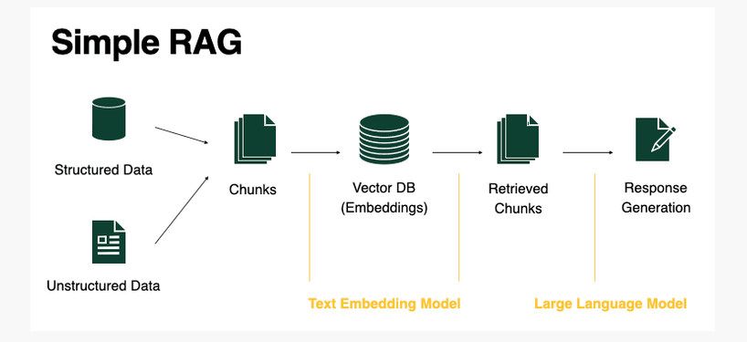

# 🎓 Study Assistant - Full-Stack RAG-based AI Chatbot

A comprehensive **Retrieval-Augmented Generation (RAG)** study assistant with modern web interface and user authentication. Upload PDFs, create personal accounts, and get intelligent responses from your course materials with an intuitive dark-themed chat interface.

## 🚀 Features

### 🔐 User Authentication
- **👤 User Registration & Login**: Secure account creation with JWT authentication
- **🔒 Password Security**: Bcrypt hashing for secure password storage
- **📧 Email-based Login**: User identification via email addresses
- **� User Profiles**: Personal user accounts with profile management

### 🤖 AI-Powered Learning
- **📄 PDF Processing**: Extract and process content from lecture notes, textbooks, and study materials
- **🔍 Intelligent Search**: Vector-based similarity search through your documents
- **💬 Conversational Memory**: Maintains context across multiple questions
- **📚 Source Citations**: Shows which documents were used to generate answers
- **⚡ Fast API**: Optimized for quick responses
- **🔄 Incremental Updates**: Add new PDFs without rebuilding the entire knowledge base

### 🎨 Modern Frontend
- **🌙 Dark Theme Interface**: Professional dark-themed chat interface
- **📱 Responsive Design**: Mobile-friendly layout with Tailwind CSS
- **🎯 Intuitive Chat UI**: Real-time messaging interface with chat history
- **🔧 Interactive Sidebar**: User options and session management
- **✨ Smooth UX**: Loading states, error handling, and user feedback

## 🏗️ Architecture

### Full-Stack Architecture
```
┌─────────────────┐    ┌─────────────────┐    ┌─────────────────┐
│   React Frontend│    │   FastAPI       │    │   MongoDB       │
│   (TypeScript)  │◄──►│   Backend       │◄──►│   User Data     │
│   Auth + Chat   │    │   Auth + RAG    │    │   (Atlas/Local) │
└─────────────────┘    └─────────────────┘    └─────────────────┘
         │                       │                       
         │              ┌─────────────────┐              
         │              │   JWT Auth      │              
         │              │   Middleware    │              
         │              └─────────────────┘              
         │                       │                       
         │              ┌─────────────────┐    ┌─────────────────┐
         │              │   RAG Service   │◄──►│   ChromaDB      │
         └──────────────►│   (Business     │    │   Vector Store  │
                        │    Logic)       │    │   (Embeddings)  │
                        └─────────────────┘    └─────────────────┘
                                 │                       │
                                 ▼                       │
                        ┌─────────────────┐              │
                        │   Gemini LLM    │              │
                        │   (Google AI)   │◄─────────────┘
                        └─────────────────┘
```

### Technology Stack
**Frontend:**
- React 18 with TypeScript
- Tailwind CSS for styling
- Context API for state management
- Vite for build tooling

**Backend:**
- FastAPI with Python 3.12+
- MongoDB with Motor (async driver)
- JWT authentication
- Pydantic for data validation

**AI & Data:**
- LangChain for RAG pipeline
- ChromaDB for vector storage
- Google Gemini for LLM
- SentenceTransformers for embeddings

## 📦 Installation

### Prerequisites
- Python 3.12+
- Node.js 18+ and npm
- MongoDB (Atlas or local instance)
- Google AI API Key (Gemini)

### Backend Setup
```bash
# Clone the repository
git clone <repository-url>
cd Study-Assistant/backkend

# Create virtual environment
python -m venv env
source env/bin/activate  # On Windows: env\Scripts\activate

# Install dependencies
pip install -r requirements.txt

# Set up environment variables
cp .env.example .env
# Edit .env and add your API keys
```

### Frontend Setup
```bash
# Navigate to frontend directory
cd ../frontend

# Install dependencies
npm install

# Set up environment variables
cp .env.example .env
# Edit .env and add your backend URL
```

### Environment Configuration

**Backend (.env):**
```bash
GEMINI_API_KEY=your_actual_gemini_api_key_here
MONGODB_URL=mongodb://localhost:27017/study_assistant
JWT_SECRET_KEY=your_super_secure_jwt_secret_key_here
```

**Frontend (.env):**
```bash
VITE_API_URL=http://localhost:8000
```

### Get Required API Keys

**Google AI API Key:**
1. Go to [Google AI Studio](https://makersuite.google.com/)
2. Create a new API key
3. Add it to your backend `.env` file

**MongoDB Setup:**
- **Local:** Install MongoDB locally or use Docker
- **Cloud:** Set up MongoDB Atlas and get connection string

## 🎯 Quick Start

### 1. Start Backend Server
```bash
cd backkend
source env/bin/activate
uvicorn main:app --reload --host 0.0.0.0 --port 8000
```

Backend server will start at: `http://localhost:8000`

### 2. Start Frontend Development Server
```bash
# In a new terminal
cd frontend
npm run dev
```

Frontend will start at: `http://localhost:5173`

### 3. Access the Application
1. Open `http://localhost:5173` in your browser
2. Create a new account or login with existing credentials
3. Start chatting with your AI study assistant!

### 4. Initialize Knowledge Base (Admin)
**First time only** - Upload your PDFs to create the knowledge base:

```bash
curl -X POST "http://localhost:8000/api/rag/init-db" \
  -H "Content-Type: application/json" \
  -d '{
    "pdf_paths": [
      "assets/Sample.pdf",
      "assets/GreedyAlgorithms.pdf"
    ]
  }'
```

### 5. Test Authentication API (Optional)
```bash
# Register new user
curl -X POST "http://localhost:8000/api/auth/signup" \
  -H "Content-Type: application/json" \
  -d '{
    "email": "test@example.com",
    "password": "securepassword123",
    "full_name": "Test User"
  }'

# Login
curl -X POST "http://localhost:8000/api/auth/login" \
  -H "Content-Type: application/json" \
  -d '{
    "email": "test@example.com",
    "password": "securepassword123"
  }'
```

## 🔌 API Endpoints

### 🔐 Authentication Endpoints

#### POST `/api/auth/signup`
Register a new user account.

**Request:**
```json
{
  "email": "user@example.com",
  "password": "securepassword123",
  "full_name": "John Doe"
}
```

**Response:**
```json
{
  "message": "User created successfully",
  "access_token": "eyJhbGciOiJIUzI1NiIsInR5cCI6IkpXVCJ9...",
  "token_type": "bearer",
  "user": {
    "id": "user_id_here",
    "email": "user@example.com",
    "full_name": "John Doe"
  }
}
```

#### POST `/api/auth/login`
Login with existing credentials.

**Request:**
```json
{
  "email": "user@example.com",
  "password": "securepassword123"
}
```

**Response:**
```json
{
  "message": "Login successful",
  "access_token": "eyJhbGciOiJIUzI1NiIsInR5cCI6IkpXVCJ9...",
  "token_type": "bearer",
  "user": {
    "id": "user_id_here",
    "email": "user@example.com",
    "full_name": "John Doe"
  }
}
```

#### GET `/api/auth/profile`
Get current user profile (requires authentication).

**Headers:**
```
Authorization: Bearer your_jwt_token_here
```

**Response:**
```json
{
  "id": "user_id_here",
  "email": "user@example.com",
  "full_name": "John Doe",
  "is_active": true,
  "created_at": "2025-01-15T10:30:00",
  "updated_at": "2025-01-15T10:30:00"
}
```

### 🤖 RAG System Endpoints

#### POST `/api/rag/init-db`
Initialize the knowledge base with PDFs (first time only).

**Request:**
```json
{
  "pdf_paths": ["path/to/file1.pdf", "path/to/file2.pdf"]
}
```

**Response:**
```json
{
  "status": "success",
  "message": "ChromaDB initialized successfully with PDFs",
  "documents_processed": 2,
  "chunks_created": 157
}
```

#### POST `/api/rag/add-pdf`
Add more PDFs to existing knowledge base.

**Request:**
```json
{
  "pdf_paths": ["path/to/new_file.pdf"]
}
```

**Response:**
```json
{
  "status": "success",
  "message": "PDFs added to existing ChromaDB successfully",
  "new_documents_added": 45,
  "total_documents": 202
}
```

#### POST `/api/rag/ask`
Ask questions using the RAG system.

**Request:**
```json
{
  "question": "Explain the time complexity of binary search"
}
```

**Response:**
```json
{
  "answer": "Binary search has O(log n) time complexity because...",
  "sources": [
    {
      "source": "Algorithms.pdf",
      "chunk_id": "23",
      "content_preview": "Binary search is a divide and conquer algorithm..."
    }
  ],
  "conversation_length": 3
}
```

## 📁 Project Structure

```
Study-Assistant/
├── README.md                 # Project documentation
├── 
├── backkend/                 # FastAPI Backend
│   ├── main.py              # FastAPI application setup
│   ├── auth.py              # JWT authentication utilities
│   ├── database.py          # MongoDB connection and operations
│   ├── user_models.py       # Pydantic models for auth
│   ├── user_routes.py       # Authentication API endpoints
│   ├── routes.py            # RAG API route handlers
│   ├── service.py           # RAG business logic
│   ├── models.py            # Pydantic request/response models
│   ├── requirements.txt     # Python dependencies
│   ├── .env                 # Environment variables (API keys)
│   ├── assets/              # PDF files for knowledge base
│   │   ├── Sample.pdf
│   │   ├── GreedyAlgorithms.pdf
│   │   └── ...
│   ├── chroma_db/           # Persistent vector database
│   └── models_cache/        # Cached embedding models
│
├── frontend/                # React Frontend
│   ├── public/              # Static assets
│   ├── src/
│   │   ├── components/      # React components
│   │   │   ├── Auth.tsx     # Authentication wrapper
│   │   │   ├── Login.tsx    # Login form component
│   │   │   ├── Signup.tsx   # Registration form component
│   │   │   ├── Chat.tsx     # Main chat interface
│   │   │   └── Sidebar.tsx  # Navigation sidebar
│   │   ├── contexts/        # React contexts
│   │   │   └── AuthContext.tsx  # Authentication state management
│   │   ├── hooks/           # Custom React hooks
│   │   │   └── useAuth.ts   # Authentication hook
│   │   ├── App.tsx          # Main application component
│   │   ├── main.tsx         # Application entry point
│   │   └── index.css        # Global styles
│   ├── package.json         # Node.js dependencies
│   ├── tailwind.config.js   # Tailwind CSS configuration
│   ├── tsconfig.json        # TypeScript configuration
│   ├── vite.config.ts       # Vite build configuration
│   └── .env                 # Frontend environment variables
└── .gitignore               # Git ignore rules
```

## ⚙️ Configuration

### Environment Variables

**Backend (.env):**
- `GEMINI_API_KEY`: Your Google AI API key (required)
- `MONGODB_URL`: MongoDB connection string (required)
- `JWT_SECRET_KEY`: Secret key for JWT token signing (required)

**Frontend (.env):**
- `VITE_API_URL`: Backend API URL (default: http://localhost:8000)

### Performance Tuning
Current optimizations for fast responses:
- Chunk size: 800 tokens (vs 1000)
- Retrieval: Top 3 documents (vs 5)  
- Memory: 3 conversation turns (vs 5)
- Output: 512 tokens max (vs 1024)

### Security Features
- JWT token-based authentication
- Password hashing with bcrypt
- Protected API routes
- CORS configuration for frontend communication

## 🔄 Workflow

### First Time Setup:
1. Start backend server
2. Start frontend development server
3. Open the web application
4. Create a user account or login
5. Admin: Call `/init-db` with your PDFs
6. Start asking questions through the chat interface!

### Subsequent Sessions:
1. Start both servers (auto-loads existing database)
2. Login to your account
3. Chat with your study assistant immediately
4. Admin: Add more PDFs anytime with `/add-pdf`

### User Experience:
- **Registration/Login**: Dark-themed authentication forms
- **Chat Interface**: Real-time messaging with AI responses
- **Sidebar**: User options and session management
- **Responsive**: Works on desktop and mobile devices

## 🧠 How It Works

### User Authentication Flow:
1. **Registration**: Users create accounts with email and password
2. **Authentication**: JWT tokens provide secure session management
3. **Profile Management**: User data stored securely in MongoDB
4. **Protected Routes**: API endpoints secured with JWT middleware

### RAG System Flow:
1. **PDF Processing**: Extracts text from PDFs using PyMuPDF
2. **Chunking**: Splits documents into overlapping 800-token chunks
3. **Embedding**: Converts chunks to vectors using SentenceTransformers
4. **Storage**: Stores embeddings in ChromaDB for fast retrieval
5. **Retrieval**: Finds relevant chunks using similarity search
6. **Generation**: Uses Gemini LLM to generate answers from context
7. **Memory**: Maintains conversation history for follow-up questions

### Frontend Architecture:
1. **React Context**: Manages authentication state globally
2. **Custom Hooks**: Encapsulates auth logic and API calls
3. **Component Structure**: Modular design with reusable components
4. **Responsive UI**: Tailwind CSS for consistent styling
5. **Real-time Chat**: Interactive messaging interface

## 🛠️ Dependencies

### Backend Libraries:
- **FastAPI**: Modern web framework for the API
- **MongoDB Motor**: Async MongoDB driver
- **PyJWT**: JWT token handling
- **Bcrypt**: Password hashing
- **Pydantic**: Data validation and serialization
- **LangChain**: RAG pipeline orchestration
- **ChromaDB**: Vector database for embeddings
- **PyMuPDF**: PDF text extraction
- **SentenceTransformers**: Text embeddings
- **Google Generative AI**: LLM for answer generation

### Frontend Libraries:
- **React 18**: Modern React with hooks
- **TypeScript**: Type-safe JavaScript
- **Tailwind CSS**: Utility-first CSS framework
- **Lucide React**: Modern icon library
- **Vite**: Fast build tool and dev server

### Development:
```bash
# Backend
cd backkend
pip install -r requirements.txt

# Frontend
cd frontend
npm install
```

## 📊 Performance

### System Performance:
- **Backend Startup**: ~5-10 seconds for complete initialization
- **Frontend Load**: ~1-2 seconds for React application
- **Authentication**: <500ms for login/signup operations
- **RAG Initialization**: ~30 seconds for 4 PDFs (first time only)
- **Query Response**: ~2-5 seconds per question
- **Memory Usage**: ~300MB for backend with knowledge base
- **Storage**: ~50MB ChromaDB + MongoDB user data

### Scalability:
- **Users**: Supports multiple concurrent users
- **Documents**: Handles large document collections efficiently
- **Responses**: Optimized for quick AI responses
- **Database**: MongoDB scales horizontally for user growth

## 🤝 Contributing

1. Fork the repository
2. Create a feature branch
3. Make your changes
4. Test thoroughly
5. Submit a pull request

## 📄 License

This project is open source and available under the MIT License.

## 🆘 Troubleshooting

### Common Backend Issues:

**"GEMINI_API_KEY not found"**
- Make sure your `.env` file exists in the `backkend` directory
- Verify the API key is valid and properly formatted

**"Failed to connect to MongoDB"**
- Check your `MONGODB_URL` in the `.env` file
- Ensure MongoDB service is running (local) or accessible (Atlas)
- Verify network connectivity and credentials

**"JWT token invalid"**
- Check that `JWT_SECRET_KEY` is set in backend `.env`
- Frontend tokens expire after a certain time - re-login if needed
- Verify the Authorization header format: `Bearer <token>`

**"No existing ChromaDB found"**
- Run `/init-db` endpoint first to create the knowledge base
- Ensure PDF files exist in the specified paths

### Common Frontend Issues:

**"Cannot connect to backend"**
- Verify backend server is running on port 8000
- Check `VITE_API_URL` in frontend `.env` file
- Ensure CORS is properly configured in FastAPI

**"Login/Signup not working"**
- Check browser network tab for API errors
- Verify form validation is passing
- Check backend logs for authentication errors

**"UI styling issues"**
- Ensure Tailwind CSS is properly installed
- Check for CSS conflicts or missing imports
- Verify responsive breakpoints are working

### Performance Issues:

**Slow responses**
- First query is slower due to model loading
- Subsequent queries should be faster
- Check network latency to Google AI API

**Memory issues**
- Monitor ChromaDB size with large document collections
- Consider pagination for large chat histories
- Check MongoDB memory usage with many users

### Getting Help:
- Check terminal output for detailed error messages
- Verify all environment variables are properly set
- Test API endpoints individually using curl or Postman
- Check browser developer tools for frontend errors
- Ensure all dependencies are installed correctly

### Development Tips:
- Use hot reload for both frontend and backend development
- Check API documentation at `http://localhost:8000/docs`
- Use MongoDB Compass for database inspection
- Enable debug logging for detailed error tracking

## 🎨 Screenshots

### Chat Interface


*Main chat interface showing the dark-themed design with real-time AI conversation, sidebar navigation, and responsive layout*

### Key Visual Features:
- **🌙 Dark Theme**: Professional gray color scheme with blue accents for optimal study sessions
- **💬 Real-time Chat**: Interactive messaging with the AI assistant showing questions and detailed responses
- **📁 Sidebar Navigation**: Clean sidebar with user options and session management
- **📱 Responsive Design**: Mobile-friendly layout that works across all devices
- **⚡ Fast Responses**: Quick AI-powered answers with source citations from your study materials

### Authentication Interface
- **Login Page**: Clean dark-themed login form with email and password fields
- **Signup Page**: User registration with full name, email, and password
- **Responsive Design**: Mobile-friendly authentication flows

### Admin Features
- **PDF Management**: API endpoints for document administration
- **User Management**: MongoDB-based user profiles and authentication
- **System Monitoring**: Comprehensive logging and error tracking

---

**Happy studying with your AI-powered learning assistant! 🎓✨🤖**